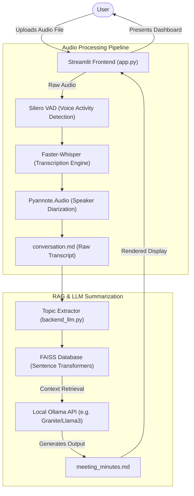

# System Architecture Diagram

This document illustrates the current, single-user, offline architecture of your Meeting Transcript generator. Because everything runs sequentially on your local machine, the infrastructure is completely self-contained within Python without the need for external network configurations.

## Visual Pipeline Diagram

### Component Breakdown
1. **Frontend:** `Streamlit` provides the immediate, singular web interface bound directly to the local Python script. Since it's synchronous and only you are using it, it safely freezes up during processing without tearing down any network sockets.
2. **Audio Engineering:** The transcription pipeline relies on a chain of robust open-source tools: `Silero` (for cutting out silences), `Faster-Whisper` (for heavy speech-to-text natively), and `Pyannote` (for tagging who is speaking). 
3. **Intelligence (RAG):** Instead of stuffing an entire hour-long meeting into the LLM, the system securely chunks the document, embeds it locally into `FAISS`, and dynamically extracts the most vital contextual memories.
4. **Synthesis:** Finally, your local `Ollama` daemon receives the surgical context windows and drafts the highly-structured meeting minutes completely offline!
